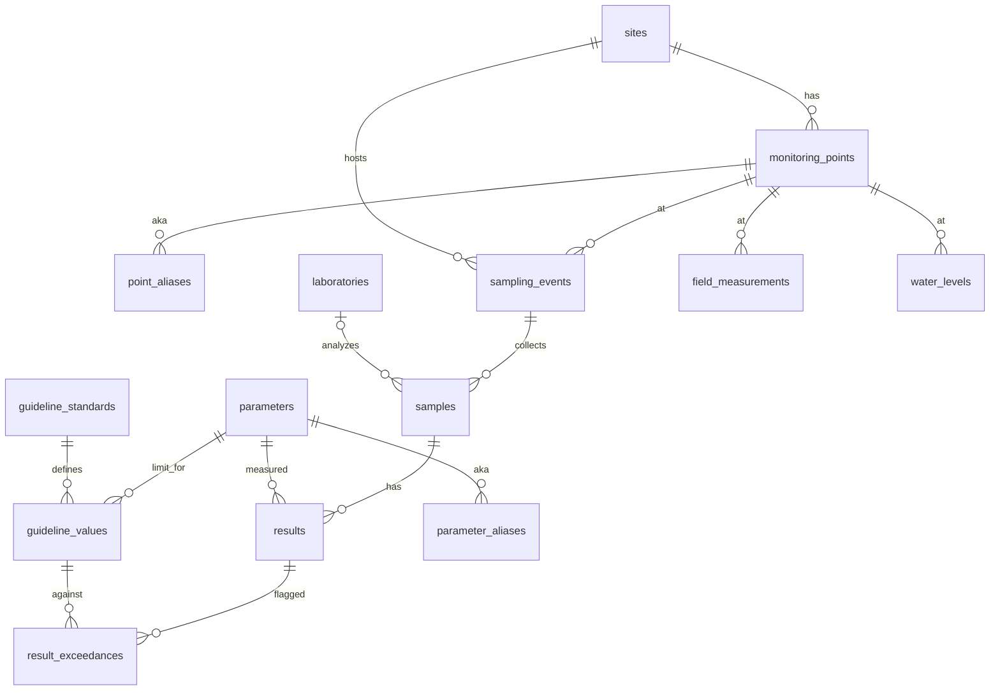

# EcoDB

TO REWRITE: for Window Server

Relational database for environmental monitoring (air, surface water, groundwater, soil, vegetation). Built on PostgreSQL 14 with PostGIS, intended for use with ArcGIS Enterprise Query Layers.

Spatial data uses **WGS84 / EPSG:4326**. The application schema is `eco`.

## Requirements

- [Docker](https://docs.docker.com/get-docker/) and Docker Compose
- PostgreSQL client tools (`psql`, `pg_isready`) on the host — needed to run migrations

On macOS:

```bash
brew install libpq
# then add libpq to PATH, e.g. echo 'export PATH="/opt/homebrew/opt/libpq/bin:$PATH"' >> ~/.zshrc
```

## Quick start

```bash
git clone https://github.com/TimurMZh/EcoDB.git
cd EcoDB

docker compose up -d
chmod +x sql/apply.sh
./sql/apply.sh
```

Default connection:

| | |
|---|---|
| Host | `localhost` |
| Port | `5432` |
| Database | `eco_monitoring` |
| User / password | `eco` / `eco` |

Override with `PGHOST`, `PGPORT`, `PGUSER`, `PGDATABASE`, `PGPASSWORD` if needed.

Adminer (web SQL UI) is at [http://localhost:8080](http://localhost:8080). Server: `postgis`, credentials as above.

## Migrations

Numbered SQL files in `sql/migrations/` are applied in order. Already-applied versions are skipped (`eco.schema_migrations`).

| File | Contents |
|---|---|
| `001_init.sql` | PostGIS extension, schema `eco`, migration log |
| `002_tables.sql` | Tables, constraints, media-type and QC reference data |
| `003_indexes.sql` | GIST on geometry, btree indexes, unique keys |
| `004_functions.sql` | Triggers, lab-value parsing, exceedance checks, staging ETL |
| `005_views.sql` | ArcGIS Query Layer views and `SELECT` grants |

Rebuild the schema from scratch:

```bash
./sql/apply.sh --reset
```

## Schema overview

Full ER diagram with attributes: [docs/er-diagram.md](docs/er-diagram.md).



**Media types:** `air`, `surface_water`, `groundwater`, `soil`, `vegetation`.

**QA/QC codes:** `A` / `B` / `C` (included in latest results), `D` / `R` (rejected / review — excluded from `vw_latest_results`).

Reference catalogs are loaded by Phase 2 (`python3 etl/phase2.py seed`) from `DB_input/Ecology_DB_general*.xlsx`.

## Lab import

Phase 2 seeds dictionaries and loads the air Excel as batch `AIR_PILOT`:

```bash
./sql/apply.sh
python3 etl/phase2.py
```

`etl/phase2.py` inserts raw air rows into `eco.staging_lab_import` and runs `fn_process_staging_import('AIR_PILOT')`. The function maps point and parameter aliases, parses values such as `<0.01` and «не обн.», upserts events / samples / results, and records failures on the staging row (`process_error`). Empty HCN cells are stored as «не обн.» (confirmed in the PDF); other empty air cells are left empty and rejected. Source PDK in the Excel file is stored in `extra_json` but limits come from `guideline_values`. Exceedances are calculated by trigger.

Phase 3 loads the 2025 water report tables and the named wells from the PDF. It does not reuse the air parser. Blank quarter cells are skipped; «нет» is stored and rejected as “not measured”. The PDF has no sample date, so wells are dated 2025-01-01 and flagged in `extra_json`.

```bash
./sql/apply.sh
python3 etl/phase3.py
psql -h localhost -U eco -d eco_monitoring -v ON_ERROR_STOP=1 -f sql/verify_phase3.sql
```

Batches: `WATER_SURFACE_2025` (points `SW-1`…`SW-4`), `WATER_GROUND_2025` (`GW-1`…`GW-10`), `WATER_WELLS_PDF` (`ФС-1`, `ФС-4`, `ФС-5`, `НС-2`). `GW-1`…`GW-4` repeat the surface Q1 values; they stay separate until that is confirmed. PDK in the water Excels is `0` and is not used.

Phase 4 assigns QC codes and writes the spot-check act. Rules are in `eco.qa_rules` (A verified against the PDF, B below detection as reported, C default, R review — including blanks stored as «не обн.»). D and R stay out of `vw_latest_results`.

```bash
./sql/apply.sh
python3 etl/phase4.py
psql -h localhost -U eco -d eco_monitoring -v ON_ERROR_STOP=1 -f sql/verify_phase4.sql
```

The act is `docs/qa_phase4_report.md`.

To recompute all exceedances after changing guideline values:

```sql
SELECT eco.fn_recalc_all_exceedances();
```

## Views (ArcGIS Query Layers)

Each view has a unique integer `objectid` and optional `geom` (`Point`, 4326). Null geometry is allowed.

| View | One row per | `objectid` |
|---|---|---|
| `eco.vw_results_flat` | lab result | `result_id` |
| `eco.vw_exceedances_summary` | result × standard | `exceedance_id` |
| `eco.vw_latest_results` | latest result per (point, parameter) | `result_id` |
| `eco.vw_water_levels` | groundwater level | `level_id` |

Register these as Query Layers in ArcGIS Enterprise against the `eco` schema.

## Smoke test

Applies sample inserts, import, and exceedance checks, then **rolls back**:

```bash
psql -h localhost -U eco -d eco_monitoring -v ON_ERROR_STOP=1 -f sql/verify_phase1.sql
```

Password: `eco`. Requires the schema to be applied first.

After Phase 2 data load:

```bash
psql -h localhost -U eco -d eco_monitoring -v ON_ERROR_STOP=1 -f sql/verify_phase2.sql
```

## Oskemen air-quality dataset

Hourly air quality for Oskemen (Ust-Kamenogorsk) is pulled from AirData.kz the same way Almaty was built in Air-DualODE: KazHydroMet via the open dump, then a gap-filled station panel with Open-Meteo ERA5 meteorology. There is no model training step. Station files include every pollutant present in `raw/` (PM2.5, PM10, SO2, NO2, …).

```bash
python3 -m venv .venv
source .venv/bin/activate   # Windows: .venv\Scripts\activate
pip install -r dataset/requirements.txt
python dataset/fetch_oskemen_raw.py --parameters pm25 pm10 so2 no2 no co h2s o3 pmtot
python dataset/build_oskemen_stations.py
python dataset/plot_oskemen_stations.py   # optional map
```

Output lands in `dataset/Oskemen/`. The panel starts at 2023-01-01 and runs through the last hour in the fetched files (currently 2026-05). Override with `--start` / `--end`. `--min_coverage` is adjustable.

## Project layout

```
docker-compose.yml      PostGIS 14-3.4 + Adminer
docs/er-diagram.md      Entity-relationship diagram
dataset/                Oskemen air-quality fetch + station panel
etl/phase2.py           Seed dictionaries + AIR_PILOT load
etl/phase3.py           Water report + PDF well loaders
etl/phase4.py           QA/QC codes, 5% sample, spot-check report
sql/apply.sh            Apply (or reset) migrations
sql/verify_phase1.sql   Phase 1 smoke test (always ROLLBACK)
sql/verify_phase2.sql   Phase 2 row-count checks (does not roll back)
sql/verify_phase3.sql   Phase 3 water-load checks (does not roll back)
sql/migrations/         Numbered schema scripts
```

`.env` is gitignored. Compose uses the defaults above unless you change them.
