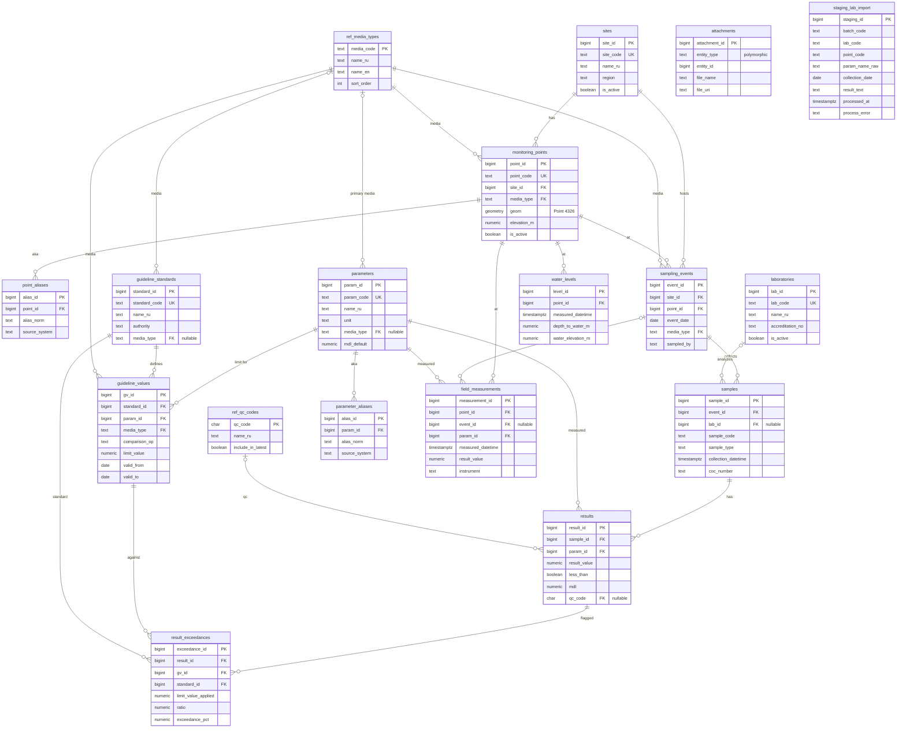

# EcoDB entity-relationship diagram

Physical model of schema `eco` (PostgreSQL / PostGIS). Source: `sql/migrations/002_tables.sql`.

Cardinalities follow declared foreign keys. `staging_lab_import` and `attachments` have no FKs (staging is a raw snapshot; attachments are polymorphic).

## Subject areas

| Area | Tables |
|---|---|
| Spatial | `sites`, `monitoring_points`, `point_aliases` |
| Sampling | `laboratories`, `sampling_events`, `samples` |
| Results | `results`, `result_exceedances`, `ref_qc_codes` |
| NSI / PDK | `parameters`, `parameter_aliases`, `guideline_standards`, `guideline_values` |
| Field | `field_measurements`, `water_levels` |
| Other | `ref_media_types`, `attachments`, `staging_lab_import` |

## Notes

- Unique on `sampling_events`: `(point_id, event_date, media_type)`.
- Unique on `results`: `(sample_id, param_id)` — re-import updates the row.
- Unique on `guideline_values`: `(standard_id, param_id, media_type, valid_from)`.
- `attachments.entity_type` is one of: `site`, `monitoring_point`, `sampling_event`, `sample`, `result`, `laboratory`.
- `staging_lab_import` is loaded first, then `fn_process_staging_import()` writes into events / samples / results.
- Views (`vw_results_flat`, `vw_exceedances_summary`, `vw_latest_results`, `vw_water_levels`) are not entities; they are Query Layer projections over this model.
